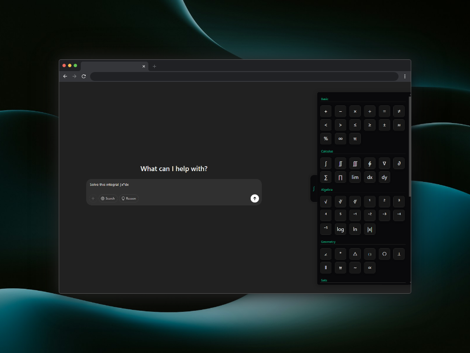

# MathGPT

## Overview

MathGPT is a Chrome extension that provides a convenient math symbol toolbox for ChatGPT. It allows users to easily insert mathematical symbols, Greek letters, and other special characters into their ChatGPT conversations without having to search for or remember Unicode characters.

## Features

- **Floating Symbol Panel**: Access a comprehensive collection of mathematical symbols with a single click
- **Categorized Symbols**: Symbols are organized into intuitive categories:
  - Basic Symbols (±, ×, ÷, etc.)
  - Calculus (∫, ∂, ∑, etc.)
  - Algebra (√, ∛, ², etc.)
  - Geometry (∠, °, △, etc.)
  - Sets (∈, ⊂, ∪, etc.)
  - Logic (∧, ∨, ¬, etc.)
  - Greek Letters (α, β, γ, etc.)
- **Customizable Display**: Enable or disable specific symbol categories based on your needs
- **Easy Copy**: Click any symbol to copy it to your clipboard
- **Tooltips**: Hover over symbols to see their names/descriptions
- **Unobtrusive Design**: The panel stays hidden until you need it

## Installation

1. Download the extension from the Chrome Web Store (link coming soon)
2. Click "Add to Chrome" to install
3. Navigate to [ChatGPT](https://chat.openai.com)
4. Look for the "∫" symbol on the right side of your screen

## How to Use

1. Visit [ChatGPT](https://chat.openai.com)
2. The MathGPT toggle button (∫) will appear on the right side of your screen
3. Hover over or click the button to open the symbol panel
4. Click on any symbol to copy it to your clipboard
5. Paste the symbol into your ChatGPT prompt
6. To keep the panel open, click the toggle button once

## Customization

You can customize which symbol categories are displayed:

1. Click on the MathGPT extension icon in your Chrome toolbar
2. Use the toggles to enable/disable specific symbol categories
3. Changes will be applied immediately

## Privacy

MathGPT operates entirely within your browser and does not:

- Collect any user data
- Track your conversations
- Send any information to external servers

## Compatibility

- Works with Chrome and Chromium-based browsers
- Compatible with ChatGPT (chat.openai.com)

## Support

If you encounter any issues or have suggestions for improvement, please open an issue on our GitHub repository.

## License

This project is licensed under the MIT License - see the LICENSE file for details.

## Acknowledgments

- Thanks to all the contributors who have helped make this extension better
- Special thanks to the mathematical and scientific community for their input on symbol selection
